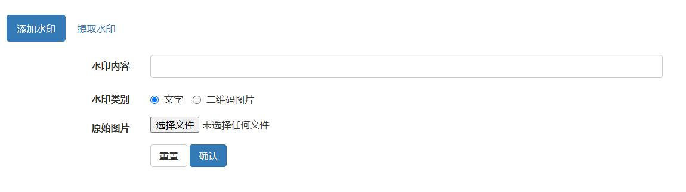
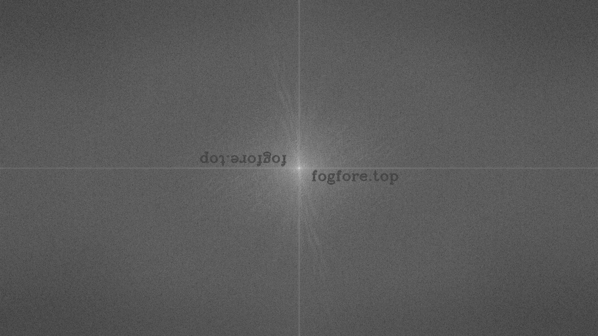
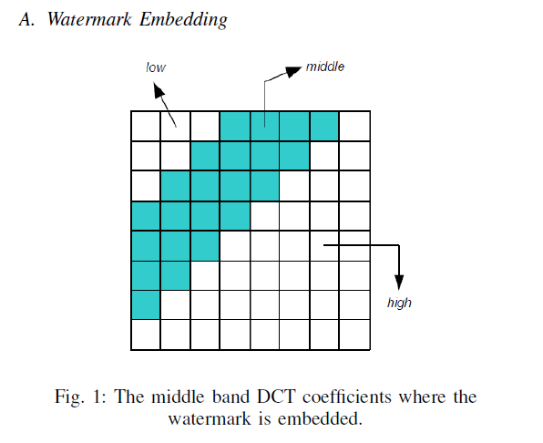
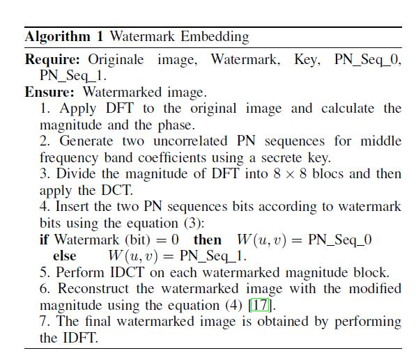
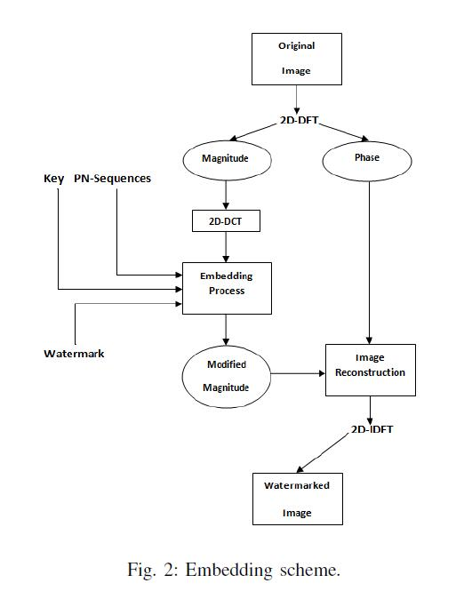
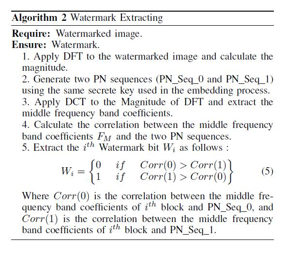

# 图片盲水印系统

*  **体验：**[点击直达](http://fogfore.top)  

## 添加水印

* **文字水印：不支持中文字符**
* **二维码水印：将内容转化成二维码，再加入到图片中**

## 提取水印

* **输入加了水印图像**
* **选择之前加的水印的类别**

## 效果展示

* **原图**

  

* **加文字水印**

  

* **加二维码水印**

  

* **提取文字水印**

  

* 二维码水印

  

## 原理

* **文字水印：DFT**   
* **二维码水印：DCT**

## 其他

* 输出结果为PNG格式时效果最好

## TODO

> [1] A blind Robust Image Watermarking Approach exploiting the DFT Magnitude

该论文指出，**相位**相对于**幅度**更重要，**图像相位所携带的信息似乎比幅度重要得多。** 因此，选择在**幅度信息中插入水印**，因为它不会影响图像质量。

